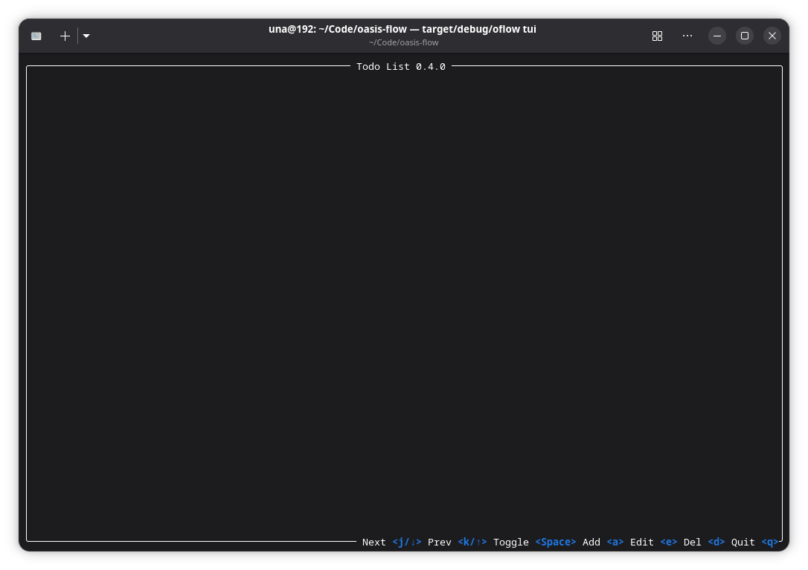
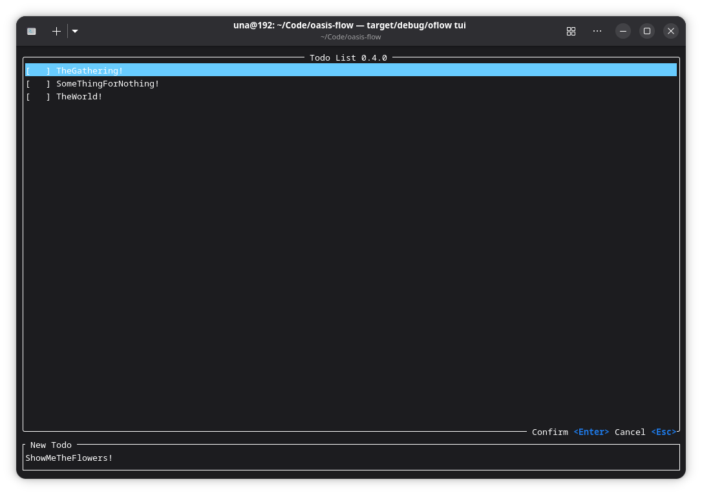

# Oasis Flow (oflow)

A focused todo CLI tool and Rust library built with Rust.

## Features

- **Add Tasks**: Quickly add new todo items
- **Finish Tasks**: Mark tasks as completed
- **Edit Tasks**: Modify existing task content
- **Clean**: Remove all finished tasks
- **List Tasks**: Display all tasks with completion status
- **TUI Mode**: Interactive terminal UI with vim-style keybindings
- **Library API**: Use `oflow` as a Rust library via [`TodoManager`]

## Installation

```bash
cargo install oflow
```

## CLI Usage

### Global Options

| Option | Description |
|---|---|
| `--data-dir <PATH>` | Custom data directory (overrides OS-specific default) |

### Add a Task

```bash
oflow add "Buy groceries"
```

### Finish a Task

```bash
oflow finish "Buy groceries"
```

### Edit a Task

```bash
oflow edit "Buy groceries" "Buy vegetables"
```

### Clean Finished Tasks

```bash
oflow clean
```

### List Tasks

```bash
oflow list
```

### TUI Mode

```bash
oflow tui
```





Launches an interactive terminal UI. Keyboard shortcuts:

| Key | Action |
|---|---|
| `j` / `Down` | Select next item |
| `k` / `Up` | Select previous item |
| `Space` | Toggle finished status |
| `a` | Add new todo |
| `e` | Edit selected todo |
| `d` | Delete selected todo |
| `q` | Quit TUI |

In input mode (Add/Edit):

| Key | Action |
|---|---|
| `Enter` | Confirm input |
| `Esc` | Cancel input |

## Library Usage

Add `oflow` to your `Cargo.toml`:

```toml
[dependencies]
oflow = "0.4.0"
```

Then use the [`TodoManager`](https://docs.rs/oflow) API:

```rust,ignore
use oflow::TodoManager;

#[tokio::main]
async fn main() -> Result<(), Box<dyn std::error::Error>> {
    let mut manager = TodoManager::new().await?;

    manager.add("Buy milk").await?;
    manager.add("Read a book").await?;
    manager.finish("Buy milk").await?;

    for todo in manager.list() {
        println!("{}", todo);
    }

    manager.clean().await?;
    Ok(())
}
```

For custom database path:

```rust,ignore
let mut manager = TodoManager::with_db_path("path/to/todos.db").await?;
```

## Data Storage

Tasks are stored in:
- A `todos.db` SQLite database for persistence
- A `todos.toml` file for TOML export
- In release mode: OS-specific data directory (e.g. `~/.local/share/oflow/` on Linux)
- In debug mode: current working directory
- Override with `--data-dir <PATH>` or `TodoManager::with_db_path()`

## Project Structure

```
src/
├── main.rs          # CLI entry point
├── lib.rs           # Library root, TodoManager API
├── commands.rs      # CLI argument parsing (clap)
├── models.rs        # Todo and TodoList data types
├── database.rs      # SQLite persistence (sync, load, query)
└── tui/
    ├── mod.rs       # TUI module root
    ├── app.rs       # TUI entry point (run_tui)
    ├── state.rs     # Application state and event handling
    └── ui.rs        # Ratatui rendering
migrations/          # SQLx database migrations
```

## Language

- [English](README.md)
- [中文](README_CN.md)

## License

This project is licensed under the Mozilla Public License 2.0. See the [LICENSE](LICENSE) file for details.
